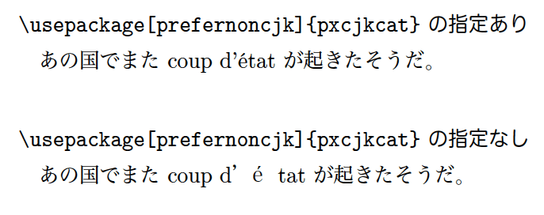
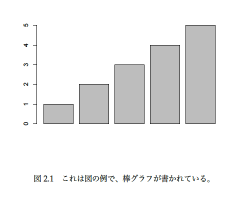
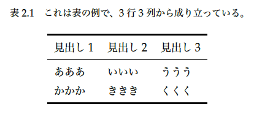
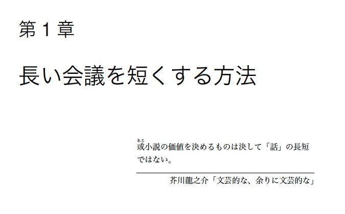
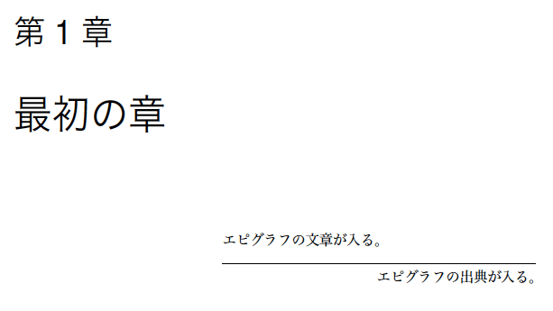

# 私家版日本語 LaTeX テンプレート（2017年5月版）

私が最近 LaTeX を使って日本語文書を作るときのテンプレートについて紹介する。
テンプレートとしては、横書き記事、横書き書籍、縦書き書籍のものを用意してある。
あわせて、LaTeX で文書を作る環境をどうやって構築しているのか、
そして、どういった命令をよく使用しているのかについて紹介する。

## はじめに

この記事では、LaTeX の私家版テンプレートについて紹介する。これは、私が最近 LaTeX で日本語文書を作るときに使っているものをまとめたものだ。2017年5月版ということで、なるべく現代的な手法を取り入れたつもりだ。

私家版テンプレートは、以下の3種類を用意している。

- 横書き記事用テンプレート（jsarticle を使用）：
	`yoko-article-template.tex`
- 横書き書籍用テンプレート（jsbook を使用）：
	`yoko-book-template.tex`
- 縦書き書籍用テンプレート（jlreq を使用）：
	`tate-book-template.tex`

いずれも、GitHub 上の [latex-templates](https://github.com/fnshr/latex-templates) というレポジトリで公開している。


以下では、次の3点について順に説明していきたいと思う。

1. LaTeX を使うときの参考資料
	- LaTeX を使うときに、どのような書籍やウェブサイトをよく参考にしているか
2. タイプセットのための準備
	- LaTeX で文書を作るための環境をどう構築しているか
	- ソースファイルをどのように編集しているか
	- ソースファイルから PDF をどうやってタイプセットしているか
3. よく使う命令
	- 私家版テンプレートでどのようなパッケージを使っているか
	- LaTeX で文書を作るときに、よく使う命令にどのようなものがあるか
4. 縦書きのために
	- 縦書きの文書を LaTeX で作るときにどのようなことに注意すればよいか


## LaTeX を使うときの参考資料

日本語文書を作るための
LaTeX の使い方を知りたければ、
まずは『［改訂第7版］LaTeX2ε美文書作成入門』という本
（以下、『美文書入門』）を読むのが良い。
必要なことは大体この本に載っている。

- 奥村晴彦・黒木裕介．(2017). 『［改訂第7版］LaTeX2ε美文書作成入門』東京：技術評論社．

改訂第7版は、2017年1月に発売されたばかりである。
古い版を持っているという人も少なくないだろうが、
LaTeX が日々進化していることを考えると、
*最新版*を買っておいて損はない。
昔の版で推奨されていたことが、
今では推奨されなくなったということもあるからだ。

また、ウェブ上の資料としては、[TeXwiki](https://texwiki.texjp.org) が最も役に立つだろう。
このサイトには、環境設定の方法や各種パッケージの使用法など、
さまざまな情報が載っている。

このほか、さらに詳しいことを知りたければ、以下のウェブサイトも役に立つ。

- [En toi Pythmeni tes TeXnopoleos
［電脳世界の奥底にて］](http://zrbabbler.sp.land.to/index.html)：LaTeX に関するさまざまな技術情報を掲載。多言語処理のための情報が豊富。
- [Acetaminophen’s diary](http://acetaminophen.hatenablog.com)：LaTeX に関するさまざまな技術情報を掲載。各種ゆきだるまを出力したい場合の情報が豊富。
- [TeX - LaTeX Stack Exchange](https://tex.stackexchange.com)：TeX/LaTeX に関する質問サイト。英語でのやりとりが主。過去の質問から得られる知見も多い。


## タイプセットのための準備

この節では、まず、LaTeX で文書を作るための環境を
私がどう構築しているのか説明する。
その次に、ソースファイルの編集方法について触れた後、
ソースファイルから PDF をどう作成しているかについて説明する。

私は、主に **upLaTeX** と **dvipdfmx** を組み合わせて日本語の文書を作っている。
ただ、ほかのソフトウェア（XeLaTeX や LuaLaTeX など）を
使うという手もあるだろう。
しかし、2017年5月現在では、upLaTeX と dvipdfmx を組み合わせるのが
無難な手法であると私は考えている。

### 環境構築

現在、LaTeX で文書を作るための環境を構築したいのであれば、
**TeXLive** をインストールするのが手軽だろう。
私は自分のPCに TeXLive 2016 を入れている。
詳しいインストール方法は、
TeXwiki の [TeX Live](https://texwiki.texjp.org/?TeX%20Live) というページに書かれているので、それに従えば良い。

また、『美文書入門』に付属している
DVD から TeXLive をインストールすることもできるので、そちらを使うのも良いだろう。

### ソースファイルの作成

#### ソースファイルの文字コード

私は、TeXのソースファイルの文字コードを UTF-8 で統一している。この際、 プリアンブルに `\usepackage[utf8]{inputenc}` と書く必要がある。

#### ソースファイル編集用のソフト

また、私は、ソースファイルの編集とタイプセットのために、
(1) TeXworks や (2) Atom を使っている。
いずれもテキストエディタとして用いることができ、
ソフト上から簡単にタイプセットすることができる。

ただし、(2) の Atom はそのままではタイプセットができない。
このため、タイプセット用の拡張パッケージとして `latex`
を導入しておく必要がある。

このほか、以下のパッケージを導入しておけば、Atom を使った編集が楽になる。

-   `language-latex`: 構文ハイライトを行う。
-   `latexer`: 命令などの自動補完を行う。
-   `pdf-view`: Atom 上で PDF を表示するためのもので、できあがった PDF を確認するときに使える。

なお、Atom を通じて LaTeX を動かすことについては、 TeXwiki の [Atom](https://texwiki.texjp.org/?Atom) というページに詳しい情報がある。

### タイプセットの流れ

私は、upLaTeX と dvipdfmx を組み合わせてソースファイルから PDF を作っている。もう少し詳しく書くと、次のような流れになる。

1. upLaTeX でソースファイルを DVI ファイルに変換する。
2. dvipdfmx を使って、DVI ファイルを PDF に変換する。

ただし、実際にタイプセットするときは、 upLaTeXと dvipdfmx
を個別に実行する必要はない。 ptex2pdf というものが用意されており、これで一気にソースファイルから PDF を作ることができる。ptex2pdf により、 upLaTeXと dvipdfmx が順次実行され、 ソースファイルから PDF が作成されるのだ。

TeXworks を使うにせよ、Atom を使うにせよ、
ptex2pdf を呼び出すようにしておけば、一発でタイプセットできる。

## よく使う命令

この節では、LaTeX を使って文書を作る際によく使う命令について記す。

### フォント関連

#### 欧文フォント

私は横書き文書を作るときには、
Palatino に基づいた新PXフォントを使うようにしている。
このフォントを使うには、 `newpxtext`, `newpxmath`
パッケージを読みこめばよい。
なお、`newpxtext` は本文のフォントを変更し、
`newpxmath` は数式のフォントを変更する。

また、等幅フォントとしては Inconsolata を使うようにしている。
このフォントを使うには、`zi4` パッケージを読みこめばよい。

#### 和文フォント

`otf` パッケージを読みこむことで、
日本語フォントを色々使えるようにしている。

この `otf` パッケージに `deluxe`
オプションをつけると、以下のように色々な書体が使えるようになる。

-   `{\mcfamily\bfseries 太明朝体}`
-   `{\gtfamily ゴシック体}`
-   `{\gtfamily\bfseries 太ゴシック体}`
-   `{\gtfamily\ebseries 極太ゴシック体}`
-   `{\mgfamily 丸ゴシック体}`


#### エンコーディング

自分のテンプレートでは、
プリアンブルにおいて、 `\usepackage[T1]{fontenc}` と
`\usepackage{textcomp}` を 指定してある。
こうすることによって、ソースコード上に入力された
アクセント付きの文字などをそのまま出すことができる。

また、プリアンブルにおいて、`\usepackage[prefernoncjk]{pxcjkcat}`と指定しておけば、和文文字とも欧文文字ともなりうるものが、なるべく欧文文字扱いで出力されるようになる。 これを指定しないと、 アクセント付きのラテン文字が、和文文字扱いされてしまい、出力がおかしくなる。

以下の例も参照されたい。



ただ、`\usepackage[prefernoncjk]{pxcjkcat}` を指定すると、「●」や「■」といった幾何学的図形を示す文字まで欧文扱いされてしまう。これらは和文文字扱いしたいので、プリアンブルで `\cjkcategory{sym18}{cjk}` と記述している。

このあたりのことの詳細は、『美文書入門』の12.4節に載っている。


### 図表

#### 図の出力

私のテンプレートでは、図を読みこんで出力するために、
プリアンブルで
`\usepackage[dvipdfmx, hiresbb]{graphicx, xcolor}` を指定している。

図は基本的に PDF で用意しておくと取り扱いやすい。かつてのように、EPS にしておく必要はない。

`barplot01.pdf` という図を出力したい場合は、 `figure` 環境の中に
`\includegraphics{barplot01.pdf}` という命令を入れる。 `\includegraphics`
の後に、 `\caption` という命令を入れることで、
キャプションを表示することができる。

また、`\label{fg:figure-example}` という ラベルを `figure`
環境の中に置いておけば、 `図\ref{fg:figure-example}` で
図の番号を取得できる。

以下に図の出力例を挙げる。




#### 表の出力

表を出力するときには、`table` 環境を使う。
`table` 環境の中に、`tabular` 環境を
記述することで表を作成する。
なお、横罫線を引くために、`booktabs` パッケージを使う。
縦罫線はなるべく引かない。

`table` 環境の前に、 `\caption` という命令を入れて、キャプションを表示することができる。なお、図の場合はキャプションを図の下に置くが、表の場合はキャプションを表の上に置くのが普通である。

また、`\caption` のあとに、`\label{tb:table-example}` というラベルを置いておけば、 `\ref{tb:table-example}` で表の番号を取得できる。




また、横長の大きな図表を載せるときに、 90度回転させて表示させたいことがある。
この場合は、`lscape` パッケージが提供する `landscape` 環境を使う。
以下はその例である。


### 囲み枠

囲み枠を作るには、`tcolorbox` パッケージを使うのが便利である。

私の横書き用のテンプレートでは、`note` という環境を用意して、
コラム的な囲み記事を書くときに使えるようにしている。
これは、`tcolorbox` パッケージの機能を用いたものであり、
以下のように定義している。

```
\newtcolorbox{note}[1]{
  breakable, % ページをまたいでボックスを分割
  before skip=20pt plus 2pt minus 2pt, % ボックスの前の空き
  after skip=20pt plus 2pt minus 2pt, % ボックスの後の空き
  boxrule=0.4pt, % ボックスの罫線の太さ
  colframe=black!95, % フレームの色
  colback=white!95, % ボックスの背景色
  fonttitle=\gtfamily\bfseries, % タイトルのフォント
  title=#1 % タイトルのテキスト
}
```

例えば、本文中で以下のように `note` 環境を記述したとしよう。

```
\begin{note}{囲み記事のタイトル}
囲み記事の文章がここに入る。
囲み記事の文章がここに入る。
囲み記事の文章がここに入る。
囲み記事の文章がここに入る。
囲み記事の文章がここに入る。
囲み記事の文章がここに入る。
囲み記事の文章がここに入る。
囲み記事の文章がここに入る。
\end{note}
```

すると、以下のように出力される。


また、横書き用のテンプレートでは、以下のような参考情報を出力する命令として `\sanko` を用意してある。これも、`tcolorbox` パッケージの機能を用いている。


### エピグラフの出力
`epigraph` パッケージを用いることで、
エピグラフを出力することができる。
エピグラフとは、章の冒頭に置かれる警句や名言のことを指す。
通常はその章の内容を示唆するものが置かれる。

例えば、以下のようなものだ。



私の横書き書籍用のテンプレートでは、プリアンブルに以下のように
記述している。

```
\usepackage{epigraph}
\setlength{\epigraphwidth}{.6\textwidth}
```

ここでは、`epigraph` パッケージを読みこんだ上で、
エピグラフの幅が、本文テキスト幅の6割になるように設定している。

そして、エピグラフを出力したい場所に以下のような命令を記述する。

```
\chapter{最初の章}

\epigraph{エピグラフの文章が入る。}{エピグラフの出典が入る。}
```

すると、以下のように出力される。




### ソースコードの出力

シンタックスハイライトがなされたソースコードを出力するには、 `listings` パッケージを用いる。


```
\begin{lstlisting}[caption=簡単なプログラムの例, label=ls:example]
x <- c(24, 23, 15, 52, 63)
mean(x) # 平均を計算
\end{lstlisting}
```

例えば、上記のように入力することで、
以下のようにシンタックスハイライトされたものが出力される。


###  その他の文字装飾

#### 圏点

圏点は、語句を強調するために振る点のことである。 圏点を出力するには、 `okumacro` パッケージを読みこんだ上で、 `\kenten{圏点}` とする。


#### ルビ

ルビをふるには、`pxrubrica` パッケージの `\jruby` という命令を使う。
なお、`pxrubrica` パッケージには `\ruby`という命令で
ルビをふる機能も付いているが、`okumacro` パッケージの
`\ruby` とかぶるため、ここでは用いない。

基本的には、`\jruby{漢字}{かん|じ}` の形で書く。グループルビにしたければ、`\jruby[g]{弥生}{やよい}` のように、`[g]` をつける。

いくつか例を挙げよう。

```
\jruby{黄}{き}と\jruby{赤}{あか}と
\jruby{緑}{みどり}の
\jruby{高価}{こう|か}で
\jruby{貴重}{き|ちょう}なものを
\jruby{購入}{こう|にゅう}しました。
\jruby[g]{閑話休題}{それはさておき}、
\jruby[g]{昨日}{きのう}は
\jruby[g]{心太}{ところてん}を
ありがとう。
```

上記のように入力すると、以下のように出力される。


### `hyperref`

`hyperref` パッケージを用いると、PDF にリンクを貼ったり、
PDF にしおりをつけたりすることができる。
プリアンブルで `hyperref` パッケージを読みこむときに、
リンクの色やしおりの形式などを
オプションで指定することができる。

なお、そのままではPDFのしおりの日本語に文字化けが発生する。
これを防ぐには、 プリアンブルで `\usepackage{pxjahyper}` と記述する。

## 索引

索引をつけるには、プリアンブルで
`\usepackage{makeidx}` と `\makeindex`
を宣言しておく。
その上で、索引に載せたい項目がある場所に
`\index{よみ@見出し語}`と入力する。
そして、索引を出力したい箇所 `\printindex` と記述する。

索引を出力するときは、MakeIndex（あるいは upmendex）というプログラムを
走らせる必要がある。

索引の作成については、
TeXwiki の「[索引作成](https://texwiki.texjp.org/?%E7%B4%A2%E5%BC%95%E4%BD%9C%E6%88%90)」というページにもっと詳しい情報がある。
また、『美文書入門』10章も参考のこと。

## 目次

目次を出力したい場所に、`\tableofcontents`
と記述することで、目次を出力することができる。

## 縦書きのために

### `jlreq` ドキュメントクラス

日本語の縦書きをするためのドキュメントクラスには `tarticle`, `tbook`
などがあるが、私の縦書き用テンプレートでは、 最近出た `jlreq`
というドキュメントクラスを 使用している。

この `jlreq` ドキュメントクラスは、 「日本語組版処理の要件」を
実装することを目的としたもので、 2017年2月に最初のバージョンが出た。
このドキュメントクラスは、横書きで組むこともできるし、
縦書きで組むこともできる。 縦書きで組みたければ、
ドキュメントクラスを読みこむときに、 `tate` オプションを指定する。

私の縦書きテンプレートでは、ドキュメントクラスとして `jlreq` を指定するときに、以下のオプションを指定している。

```
\documentclass[ % ドキュメントクラス
    uplatex, % upLaTeXを使う
    tate, % 縦書き
    hanging_punctuation, % ぶら下げ組
    paper=b6, % 用紙サイズ
    reference_mark=interlinear, %注の合標を行間に
    book % 書籍のためのスタイル
]{jlreq}
```

用紙サイズを A5 より大きくするときは、
二段組のオプション `twocolumn`を指定するか、
余白を調整したほうがよい。
さもなければ、1行が長くなりすぎて、読みづらくなってしまう。

なお、`jlreq` ドキュメントクラスでは、
比較的容易に見出しの体裁を変えることができる。
私の縦書きテンプレートでも、こうした機能を使って、
見出しの体裁を変えている。


#### 注釈

`jlreq` ドキュメントクラスにはさまざまな注の形式が用意されている。

縦書きの場合、`\sidenote` という命令で、
脚注をもうけることができる。
これは、本文の下側に出力される。
ただし、脚注用の余白を十分に用意しておかなくてはならない。

また、`\endnote` という命令で、 後注をもうけることができる。
後注はデフォルトでは次の見出しの直前に出力される。
要するに、節などの末尾にまとめて注が出てくるというわけだ。

割注は、`\warichu` という命令で作ることができる。 
割注を作成するときは、
一回のコンパイルではうまくいかないことがある。
状況によっては複数回コンパイルする必要がある。


### 漢文

ここからは、`jlreq` ドキュメントクラスを用いるときにかぎらず、縦書き文書作成時に共通することについて記す。

漢文を出力したい場合、`sfkanbun` パッケージを用いる。
このパッケージは TeXLive に入っていないので、
<http://xymtex.my.coocan.jp/fujitas2/texlatex/index.html> から
入手する必要がある。
また、入手したあとに `sfkanbun.sty` の文字コードを
 UTF-8 にしておく必要がある。

実際の出力を行うには、
`\kundoku{漢字}{ルビ}{送り仮名}{返り点}[肩返り点]<左送り仮名>(句読点)`のような形にする。

例えば、「未知仁義也」という漢文に
送り仮名や返り点を付ける場合を考えよう。

```
\kundoku{未}{いま}{ダ}{レ}<ル>
\kundoku{知}{}{ラ}{二}
仁
\kundoku{義}{}{ヲ}{一}
\kundoku{也}{}{}{}(。)
```

この場合、上記のように入力すれば、以下のように出力できる。


### 傍点・圏点・傍線

傍点・圏点・傍線は以下の命令で出力することができる。

```
\bou{傍点}・\kenten{圏点}・\kasen{傍線}
```

その出力結果は、以下の通りである。


### くの字点

くの字点を入力するには、「〳〵」や「〴〵」とソースコードに直接入力すればよい。あるいは、`\ajKunoji` や `\ajDKunoji` としても出てくる。いずれにせよ、`otf` パッケージを読みこむことが必要である。


### 数字

算用数字で数を表現するとき、縦中横にしたければ、`\rensuji{12}`
のようにする。この命令で、 以下のように出力される。


### 目次
目次でのページ番号は、上述のような縦中横で表示される。
しかし、`hyperref` パッケージを用いる場合、目次の数字が寝てしまう。
これは、`hyperref` パッケージが縦書き時の目次の出力方法を上書きしてしまうからである。

これを防ぐために、私のテンプレートでは、
プリアンブルにおいて以下のように記述している。

```
\makeatletter
\def\contentsline#1#2#3#4{\csname l@#1\endcsname{\hyper@linkstart{link}{#4}{#2}\hyper@linkend}{\rensuji{#3}}}
\makeatother
```

これにより、目次の数字が寝ることがなくなる。

この問題については、以下のページで別の対策も記されているので、
適宜参照されたい。

- [pLaTeX縦書きでhyperrefパッケージを使うときの変更点](http://qiita.com/munepi/items/004d19a657d3bf2d4ded)
- [TBOOK.CLS と HYPERREF.STY の組み合わせ](https://interstadial.wordpress.com/2007/06/28/tbookcls-%E3%81%A8-hyperrefsty-%E3%81%AE%E7%B5%84%E3%81%BF%E5%90%88%E3%82%8F%E3%81%9B/)